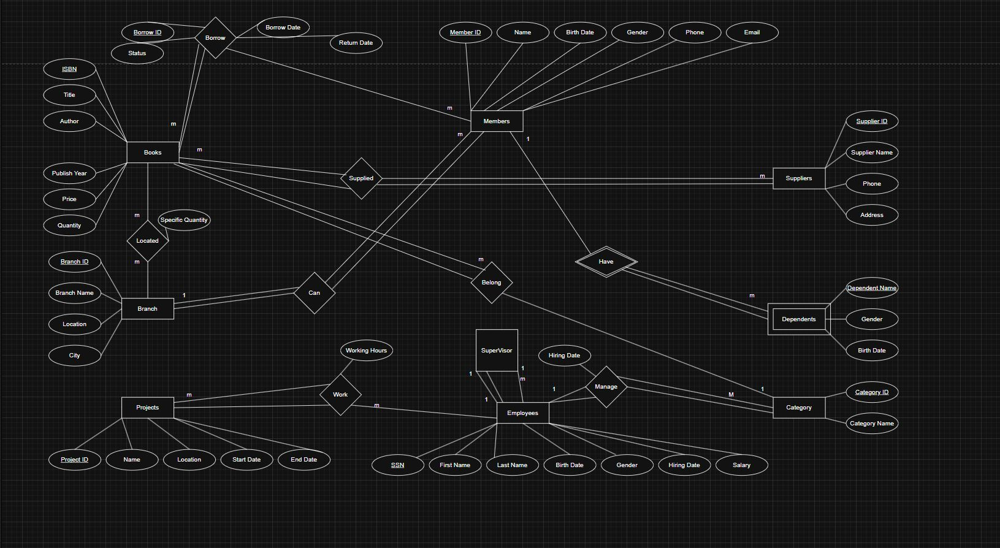

# 🗄️ From ERD to Database Tables  
## Database Design Project

---

## 📌 Project Overview
This project demonstrates the **complete database design lifecycle**, starting from  
**Entity Relationship Diagrams (ERD)** and transforming them into **well-structured, normalized relational database tables** ready for SQL implementation.

The project focuses on understanding business requirements, identifying entities and relationships, and converting conceptual designs into a logical database schema.

---

## 🎯 Project Objectives
- Design clear and accurate ERDs based on business requirements
- Identify entities, attributes, and relationships
- Apply database normalization principles
- Convert ERD structures into relational database tables
- Prepare the schema for SQL implementation and data analysis

---

## 🧩 ERD Design
The ERD diagrams illustrate:
- Core entities and their attributes
- One-to-One, One-to-Many, and Many-to-Many relationships
- Junction (associative) tables for M:N relationships
- Primary Keys (PK) and Foreign Keys (FK)

### 🔹 Sample ERD Diagrams

---

## 🗂 Database Tables Design
Based on the ERD analysis, the following database tables were designed:

### 🔹 Core Tables
- Student
- Course
- Group
- Instructor
- Session
- Payment

### 🔹 Junction Tables
- Student_Group  
- Student_Session  

These tables ensure **data integrity**, proper relationship handling, and scalability.

---

## 🛠 Tools Used
- ERD Design Tools
- Database Design Principles
- SQL-ready Relational Modeling

---

## 🔗 Key Design Considerations
- Elimination of data redundancy through normalization
- Clear definition of Primary Keys and Foreign Keys
- Logical separation of entities
- Support for scalability and future system expansion

---

## 📁 Project Files
- ERD diagrams (images)
- Database schema documentation
- Relational tables design

---

## 🚀 Portfolio Value
This project demonstrates:
- Strong understanding of database fundamentals
- Ability to translate business requirements into data models
- ERD to relational schema transformation skills
- Readiness for SQL development and data analysis projects

📌 This project is part of my **Data Analyst / Database Design Portfolio**.
